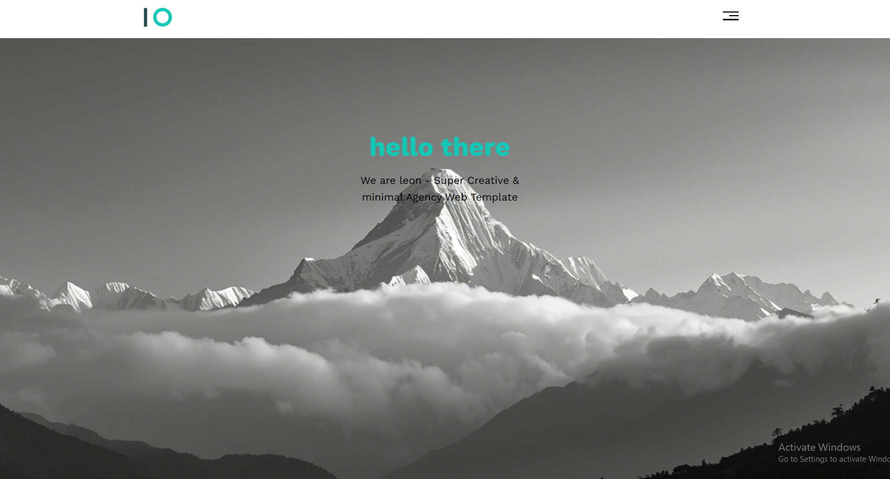

# 🌐Template 1 - Responsive Landing Page

A modern and responsive landing page built using HTML and CSS. This project focuses on clean UI design, layout structure, and responsive behavior across different screen sizes.
## 🌐 Live Demo
👉 [View Project]( https://sherift911.github.io/Template-1---Responsive-Landing-Page-HTML-CSS-/)

---

## ✨ Features
- Fully responsive design
- Clean and modern UI
- Multi-section layout (Services, Portfolio, About, Contact)
- Hover effects and smooth interactions
- Font Awesome icons integration
- Google Fonts styling

---

## 🧱 Sections
- Header with navigation menu
- Hero / Landing section
- Features section
- Services section
- Portfolio section
- About section
- Contact section
- Footer

---

## 🛠️ Technologies Used
- HTML5
- CSS3
- Flexbox & Grid
- Font Awesome
- Google Fonts

---

## 🚀 How to Run
Just open the `index.html` file in your browser.

---

## 📁 Project Structure
/css
/images
index.html

---

## 💡 What I Learned
- Responsive layout design
- CSS Grid & Flexbox
- UI structuring
- Component-based styling

---

## 👨‍💻 Author
Made with ❤️ using HTML & CSS

